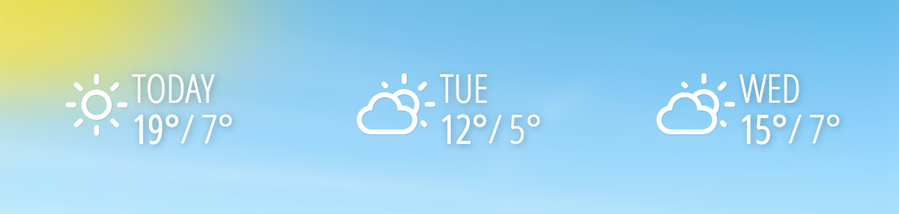

# OnSign TV Custom Apps

**We want to help YOU to create APPs like this one**:

To make this task easier, we took some time to write guides showing you how smoothly is to make beautiful Apps and publish them to your players all around the world.

You can start reading up on how to [create your own OnSign TV Apps](docs). There are sections explaining how the Apps are [structured](docs#creating-your-own-onsign-tv-apps); how to give your end-user [flexibility and control](docs#app-configuration) when using your Apps [through special `<meta> tags`](docs#available-app-configuration-types) and a section on [available utilities](docs#available-utilities) you can use to manipulate end-user data.

We would like to ease your entrance into the world of App creation showing [the source code](samples) of some of our most used Apps. You'll get to see the appearance of them along a small description of what they can do with access to all the code needed to make them work. [Check how the weather forecast App above was created](samples/weather/weather-forecast-horizontal-bar/app.html) to get started.

Hope you have a good time and enjoy being creative with our platform. Cheers!
