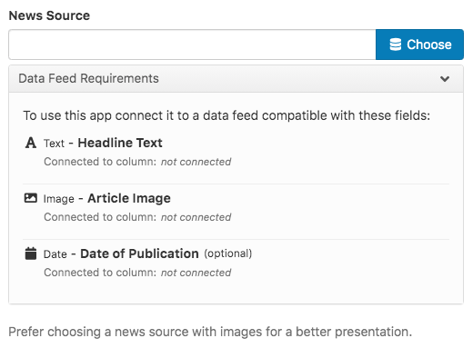
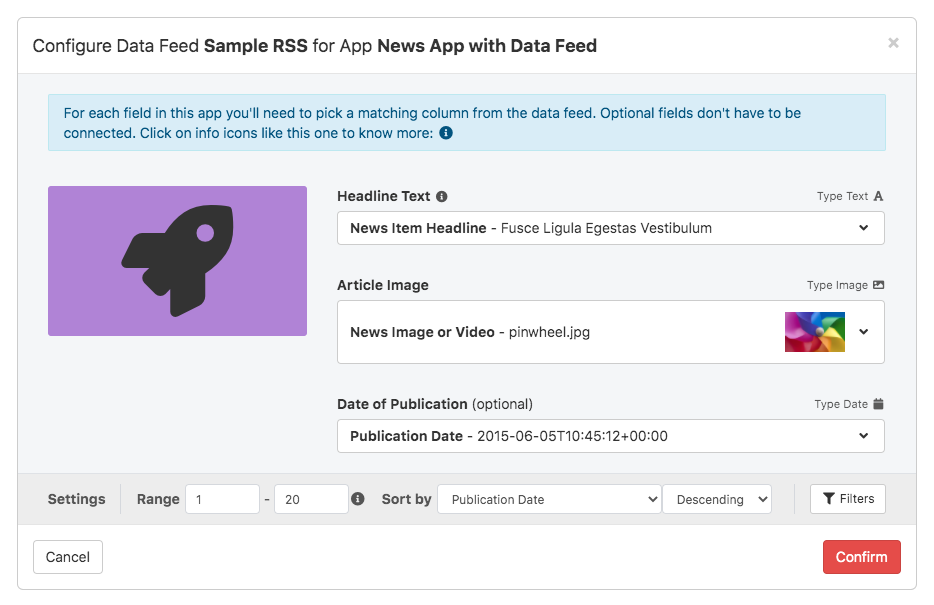

# `datafeed` Overview

The `datafeed` type is meant to allow a greater flexibility for the end-user. Instead of requiring the user to display data from Facebook, Instagram, Twitter and RSS in different apps, any **Data Feed** can be linked with the app, as long as its columns matches the required fields for display.

**Data Feeds** are a new feature of OnSign TV. This type is one of the most complex, because it allows the end user to provide data in a structured table format, either manually inputing data or automatically pulling it from Facebook, Instagram, Twitter, RSS and even another Data Feed. Every entry in the Data Feed can be edited and moderated by the end user, allowing total control of what is displayed in the app.

It is up to you, the app developer, to specify what kinds of data you are going to display. For instance, a "News App" might require a news title, news body, news image and publication date. But a "Menu Board App" it might only require a menu item name and price. Your task is to specify in the app what kind of data will be displayed and it's up to the user to match that requirement with a **Data Feed** they have that data. If the users doesn't have one, it's easy to create a new **Data Feed** with the data.

Because this type is more complex it cannot be added through a `<meta>` tag or `__config__` function. It has its own dedicated `__datafeed__` function.

```html+jinja
<!DOCTYPE html>
<html>
  <head lang="en">
    <title>News App with Data Feed</title>
    {# When using Javascript you need to load the SDK first #}
    {{ __loadsdk__ }}
    {{
      __datafeed__(name='newsFeed', label='News Feed', fields=[
        __field__(name='title', type='text', label='Headline Text', help='Keep text under 150 characters.'),
        __field__(name='image', type='image', label='Article Image'),
        __field__(name='published_at', type='date', label='Date of Publication', optional=true),
      ], help='Prefer choosing a news source with images for a better presentation.')
    }}
  </head>
  <script>
    function handleData(data) {
      for (var i = 0; i < data.source.length; i++) {
        console.log(data.source[i].title);
        console.log(data.source[i].image.url);
        console.log(data.source[i].published_at);
      }
      data.update.then(handleData);
    }
    window.newsFeed.then(handleData);
  </script>
</html>
```

This `datafeed` will be displayed to the end-user as picker, like so:



After choosing which Data Feed they will display, the user then chooses which column of the Data Feed is connected to each `__field__` required by your app.



Once connected the `datafeed` will be available in the browser [`window`][1] as a [`Promise`][2] with the name you specified in the `__datafeed__(name="")` parameter.

> **Heads up**: using a data feed automatically inserts a [Promise polyfill](https://github.com/taylorhakes/promise-polyfill) in the browser, in order to improve compatibility.


## `__datafeed__` Parameters

You a Data Feed you need to declare the following parameters. The `help` parameter is optional.

Parameter | Description
--------- | -----------
`name`    | Name of the data sink variable. Will be present in the browser [`window`][1] as a [`Promise`][2], resolved when the data is available.
`label`   | A label for the data sink that will be shown to the end-user to represent the data sink.
`fields`  | An array of `__field__` items, specifying all fields used by the data sink.
`help`    | Optional text containing further instructions on how to this data sink will be used, to aid the user in selecting a data feed.
`optgroup` | The group this configuration will be presented in. Groups are listed in the order they first appeared in, after any ungrouped options. Groups are collapsed by default.
`optional` | By default the end-user is required to fill in every single data feed option, except when the `optional` attribute is `true`.


## `__field__` Parameters

The number of `__field__` items for a given `__datafeed__` is be based on the data required by the developer. Only `name`, `type` and `label` are required.

Parameter  | Description
---------- | -----------
`name`     | Variable name of the field, will be present in the resolved promise.
`type`     | Type of the field. Check [field types](#field-types) below for more information.
`label`    | A label that will be shown to the end-user to aid in matching the requested field with a data feed column.
`help`     | Optional text containing further instructions on how this value will be used, help the end-user.
`optional` | By marking a field as optional the end user link it with an optional column in the data feed or not link it at all. When a field is not optional the end-user must link it to a required column and the app is guaranteed the field will be present in the resolved promise.


## Resolved Promise

Once the [Promise][2] is resolved, it will have the following data will be available on the callback:

```javascript
{
  "fields": {"field_name" : true, ... }, // fields that have been linked to a column will be true.
  "source": [ // every row in the data feed will be an object with the field name and column values.
     {"field_name" : "field_data_1", ...},
     {"field_name" : "field_data_2", ...},
  ...],
  "update": new Promise(), // This Promise will resolve whenever there are updates to the data.
}
```

All fields that are marked as `optional` must be tested for presence on each specific row before usage, because a user might have connected it to an empty column.


### Field Types

Allowed types are  `"boolean"`, `"date"`, `"datetime"`, `"image"`, `"integer"`, `"media"`, `"number"`, `"text"`, `"time"`, `"url"` or `"video"`. Type `"media"` means it can either be an `"image"` or a `"video"`.

All types map to a Javascript type when the promise is resolved:

Field Type   | JS Type   | Notes
------------ | --------- | ------------------
`"boolean"`  | `Boolean` | Can either be `true` or `false`. If `optional`, the it can be `undefined`.
`"date"`     | `String`  | Formatted in [ISO 8601 format][3]: `"2020-05-29"`
`"datetime"` | `String`  | Formatted in [ISO 8601 format][3]: `"2020-05-29T15:42:45Z"`.
`"image"`    | `Media`   | [`Media Object`](#media-object) that can only be an `"image"`.
`"integer"`  | `Number`  | Javascript Number without decimal part: `42`
`"media"`    | `Media`   | [`Media Object`](#media-object) that can either be an `"image"` or a `"video"`.
`"number"`   | `Number`  | Javascript Number with decimal part: `42.7`
`"text"`     | `String`  | May contain line breaks `\n`.
`"time"`     | `String`  | Formatted in [ISO 8601 format][3]: `"15:42:45"`.
`"url"`      | `String`  | String in the value `"https://example.org"`.
`"video"`    | `Media`   | [`Media Object`](#media-object) that can only be a `"video"`.


#### Media Object

Media objects are complex fields because they contain not only the URL needed to display the media, but also size and duration information.

```javascript
  "field_name": {
    "type": "image" // or "video", used to disambiguate the type when needed.
    "url": "https://example.com", // URL to access the data.
    "width": 1920, // in pixels.
    "height": 1080, // in pixels.
    "duration": 11.2 // in decimal seconds, only available when "type" === "video".
  }
```


[1]: https://developer.mozilla.org/en-US/docs/Web/API/Window
[2]: https://developer.mozilla.org/en-US/docs/Web/JavaScript/Reference/Global_Objects/Promise
[3]: https://en.wikipedia.org/wiki/ISO_8601
