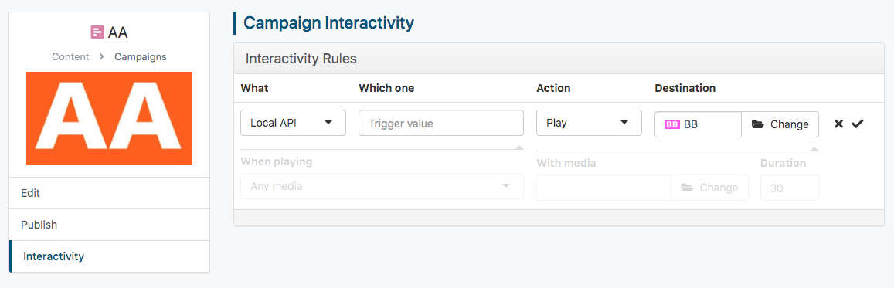

# OnSign TV Javascript API

OnSign TV players inject a Javascript object, named `signage` into all running Apps, which is accessible via the Window object. Through this object, your apps will be able to retrieve useful information regarding the player and content being played.

**Important**: Not all methods in the `signage` object are available on all platforms and most of them are not available before the [`"signageloaded"` event](#signageloaded-event) is fired. Check the [compatibility matrix](#compat-matrix) at the bottom of this page to know when you can use each method and protect uses with a `try {} catch (e) {}`.


## <a name="loadsdk"></a>Adding the `{{ __loadsdk__ }}` Directive

In order to receive any event or use any method listed in this documentation you'll need to load the Signage SDK and wait for it to finish loading.

To load the SDK you must add a `{{ __loadsdk__ }}` directive to your app. This will be required for all apps with a `<script>` tag imported after February 2023.

**Important**: The `{{ __loadsdk__ }}` directive must be placed before any `{{ __config__ }}` or `{{ __datafeed__ }}` directives, as well as before any `<script>` tag on your app.

<details><summary>Click here to expand and view an example.</summary><p>

```html+jinja
<!DOCTYPE html>
<html>
  <head lang="en">
    <title>Sample App with Events</title>
    {# When using Javascript you need to load the Signage SDK first #}
    {{ __loadsdk__ }}
    {# After loading you can add your configuration #}
    {{
        __config__(type="color", name="background_color",
            label="Text background color", value="#FFFFFF")
    }}
  </head>
  <div style="background-color: {{ background_color }};">
      SIZE: <span id="width">?</span>x<span id="height">?</span>
  </div>
  <script>
    // Now you can use sizechanged event.
    document.addEventListener("sizechanged").then(function (event) {
      document.getElementById("width").innerHTML = event.detail.width;
      document.getElementById("height").innerHTML = event.detail.height;
    });
  </script>
</html>
```

</p></details>


## Signage Events

The Signage Javascript SDK injects some events into the `document` of your app. You can use `document.addEventListener(eventName, fn)` to listen to them.

Check below for more information on each event, specially the `signageloaded` and `show` events.


### <a name="signageloaded-event">Document: `'signageloaded'` Event

This event fires when methods in the [`window.signage` object](#signage-object-api) are ready to be called.
Not all methods are available on every player version or operating system, so check the [compatibility matrix](#compat-matrix) before using them.

**Important**: This event is guaranteed to fire after the [`window.onload`][7] and is available on all platforms and versions, so it is safe to be used instead of the load event.

In case you need this event as a [`Promise`][5] you can use the [`window.signageLoaded` Promise](#signageloaded).


### <a name="show-event"></a>Document: `'show'` Event

Most of the time your app will be loaded ahead of time to avoid displaying an unfinished page to end users. When that happens the player will load your app in an invisible area of the screen and then instantly display it when the time comes. The duration of this preload vary from platform to platform, from 1 to 5 seconds.

If you have animations or other time-based transitions you need to wait for your app to actually be displayed to the end users before starting those animations and timers.

For instance, a news app that displays one article every X seconds, can only start its internal timer once the `show` event is fired. Also, since timers in Javascript aren't synchronized with the Player timers it is usually a good idea to wait up to a second after the show event is received before initializing internal timers.

**Important**: This event is guaranteed to fire after the [`window.onload`][7] and the [`signageloaded` event](#signageloaded-event). For compatibility reasons it may take up to five seconds to fire on older player versions.

In case you need this event as a [`Promise`][5] you can use the [`window.signageVisible` Promise](#signagevisible).


### <a name="restart-event"></a>Document: `'restart'` Event

This event fires when the app is being looped, meaning it should refresh information. It's useful for when the app is permanently on screen. It's up to the developer to make use of this or not, depending on the application.


### <a name="sizechanged-event"></a>Document: `'sizechanged'` Event

Event fired when the app changes size, either due to a resize by the end-user during preview or the player repositioning the iframe due to layout changes.

Contrary to the native [`window.onresize`][6] event, the `sizechange` event is properly debounced so you won't get hundreds of events for user-generated resizes.

```javascript
  // Handle resize of the app. You can get the current size through event.detail
  document.addEventListener('sizechanged', function (event) {
    var width = event.detail.width;
    var height = event.detail.height;
  });
```


## Signage Notification API

Some changes are not propagated through the `document` element, like player property or attribute changes. Those events require you to listen directly on the `signage` object and therefore cannot be registered before the `signageloaded` event is fired.


### <a name="attrchanged-event"></a>Signage: `'attrchanged'` Event

This event fires when one of the player attribute changes. Player attributes can change when an user edits them on the platform or locally through the [`signage.getPlayerAttribute("name")`](#getplayerattribute) and [`signage.setPlayerAttribute("name", "value")`](#setplayerattribute) methods.

```javascript
  signage.addEventListener('attrchanged', function (event) {
    // Name of the attribute that changed value
    var attrName = event.detail.name;
    // New value of the attribute. Can be a string, a number, or a list of strings.
    var attrValue = event.detail.value;
  });
```


### <a name="propchanged-event"></a>Signage: `'propchanged'` Event

This event fires when one of the player property changes. Property changes when user changes edit them on the platform, through a predetermined schedule or locally through the API.

There are two currently supported properties: `"brightness"` and `"volume"`.

```javascript
  signage.addEventListener('propchanged', function (event) {
    // Name of the property. Could be "brightness" or "volume".
    var propName = event.detail.name;
    // New value of the property.
    var propValue = event.detail.value;
  });
```


### <a name="serialportdata-event"></a>Signage: `'serialportdata'` Event

This event fires when data is read from the RS-232 Serial Port named in the `"alias"` parameter. The serial port configuration and alias are set on your OnSign TV player settings page.

```javascript
signage.addEventListener("serialportdata", "alias", function (event) {
  var portAlias = event.detail.name; // will contain the port alias.
  var readValue = event.detail.value; // will contain the data read.
});
```

The `event.detail.value` can either be an ASCII [`String`][9] containing a single character, an ASCII [`String`][9] containing a line of text or an [`ArrayBuffer`][10] containing the binary data read. This will depend on the configuration done by the user on OnSign TV.

Mode      | `detail.value` type | Behavior
----------|---------------------|-------------
Binary    | [`ArrayBuffer`][10] | Fires at fixed intervals depending on the source of the data.
Character | ASCII [`String`][9] | Fires one event per character read from the serial port.
Line      | ASCII [`String`][9] | Fires one event per line of text read from the serial port. The `event.detail.value` will not include line ending characters.


### <a name="contentchanged-event"></a>Signage: `'contentchanged'` Event

This event fires whenever the given `ContentID` is changed.

The `ContentID` must be acquired from a [configuration option](USERCONF.md) or from a [media file](README.md#using-media-files-on-apps). Any other method of acquiring that ID can't assume the file will exist in the player, because only published files are downloaded. Listening to changes of an unknown `ContentID` is not considered an error, the event will just never be fired.

```javascript
signage.addEventListener("contentchanged", "ContentID", function (event) {
  var contentId = event.detail.id; // will contain the given "ContentID".
});
```


## Signage Promises

Some events are also available as top-level [promises][5] that can be used with other promises and combined in new ways.

<a name="signageloaded"></a>The `window.signageLoaded` [promise][5] is guaranteed to only be resolved after the [`'signageloaded'` event](#signageloaded-event) fires, so you can also use this promise to check all your script files and the platform SDK have finished loading.

<a name="signagevisible"></a>The `window.signageVisible` [promise][5] is guaranteed to only be resolved after the [`'show'` event](#show-event) fires so you can use it to start timers in your app.

<details><summary>Click here to expand and view an example.</summary><p>

```html+jinja
<!DOCTYPE html>
<html>
  <head lang="en">
    <title>Sample App with Visible Promise</title>
    {# When using Javascript you need to load the Signage SDK first #}
    {{ __loadsdk__ }}
  </head>
  <div id="result"></div>
  <script>
    // Now you can use the signagevisible promise.
    window.signageVisible.then(function () {
      document.getElementById("result").innerHTML = "VISIBLE";
    });
  </script>
</html>
```

</p></details>


## App Configuration Object API

App configuration options that have the `js` parameter set to `True` on the `{{ __config__ }}` directive will be available to scripts through the `window.appConfig` global object.

If the configuration was marked as optional and no value was defined by the user, accessing its value on the `window.appConfig` object will return `undefined`.

If at least one configuration option was marked as `js=True` **and** the app contains internationalization options, the current locale setting will also be available on `window.appConfig.__lang__`.

**Important**: Configuration types currently supported on the `window.appConfig` object: `bool`, `choice`, `color`, `date`, `datetime`, `float`, `multichoice`, `number`, `paragraph`, `richtext`, `text`, `time`, `url`.

<details><summary>Click here to expand and view an example.</summary><p>

```html+javascript
<!DOCTYPE html>
<html lang="{{ __lang__ }}">
  <head>
    <title>appConfig Example</title>
    {{ __loadsdk__ }}

    {{ __config__(name="userDate", type="date", label="Date to be displayed", js=True) }}
  </head>
  <body>
    <div id="date-display"></div>

    <script type="text/javascript">
      window.signageLoaded.then(function() {
        var userDateInput = new Date(window.appConfig.userDate);
        var formatter = new Intl.DateTimeFormat(window.appConfig.__lang__);

        document.getElementById("date-display").innerText = formatter.format(userDateInput);
      });
    </script>
  </body>
</html>
```

</p></details>


## Signage Object API

The following methods are on the `window.signage` object. They are available to use after the [`signageloaded` event](#signageloaded-event) fires or the [`window.signageLoaded` Promise](#signageloaded) is resolved.

Please check the [compatibility matrix](#compat-matrix) to view which method is supported on which player version.

  * [`signage.playbackInfo()`](#playbackinfo)
  * [`signage.width()`](#width)
  * [`signage.height()`](#height)
  * [`signage.isVisible()`](#isvisible)
  * [`signage.getCurrentPosition()`](#getcurrentposition)
  * [`signage.getGeoLocation()`](#getgeolocation)
  * [`signage.triggerInteractivity("value" [, {"param": "pvalue"}])`](#triggerinteractivity)
  * [`signage.readContent("ContentId", {"encoding": "utf8"})`](#readContent)
  * [`signage.stopCurrentCampaign()`](#stopcurrentcampaign)
  * [`signage.stopThisItem(delay, [stopParentCampaign, [isPartialPlayback]])`](#stopthisitem)
  * [`signage.getPlayerAttribute("name")`](#getplayerattribute)
  * [`signage.setPlayerAttribute("name", "value")`](#setplayerattribute)
  * [`signage.setPlayerAttributes({"name": "value"})`](#setplayerattributes)
  * [`signage.sendEvent("level", "code", [, "message", {"extra": "values object"}])`](#sendevent)
  * [`signage.log("level", "domain", "message")`](#log)
  * [`signage.playAudio("file:///path")`](#playaudio)

There are a few methods that manipulate the player hardware:

  * [`signage.getBrightness()`](#getbrightness)
  * [`signage.setBrightness(percent)`](#setbrightness)
  * [`signage.setVolume(percent)`](#setvolume)
  * [`signage.getVolume()`](#getvolume)
  * [`signage.ledOn(red, green, blue)`](#ledon)
  * [`signage.ledOff()`](#ledoff)

Additionally there are a few methods for Text-To-Speech, on players that support such functionality.

  * [`signage.ttsSetLanguage("en")`](#ttssetlanguage)
  * [`signage.ttsSetPitch(0.9)`](#ttssetpitch)
  * [`signage.ttsSetRate(1.5)`](#ttssetrate)
  * [`signage.ttsSpeak("text to be spoken" [, {language: "es", rate: 0.8}])`](#ttsspeak)
  * [`signage.ttsSilence(2000)`](#ttssilence)
  * [`signage.ttsStop()`](#ttsstop)
  * [`signage.ttsFlush()`](#ttsflush)


### <a name="playbackinfo"></a>`signage.playbackInfo()`

Returns a stringified JSON object that bundles information about the player and the current campaign. This object can be expanded in the future to contain other types of information.

Object Model:

```javascript
  {
    // Reason this campaign was played. If there is no reason, type is defined as "unknown"
    "reason": {
      "type": "time", // Other values: "touch", "key", "geo", "timeout", "ondemand", "api" and "unknown"
      "timestamp": 15467551, // unix timestamp
      // For type === "touch"
      "x": 230, // X,Y values returned are based on a virtual screen of 100000x100000 pixels.
      "y": 470,
      // For type === "key"
      "keys": "abcd",
      // For type === "api", when using /trigger/text or signage.triggerInteractivity("text")
      "value": "text",
      // For type === "geo"
      "lat": -27.5967811,
      "long": -48.5201524,
      "direction": "in", // other possible value is "out".
      // For type === "ondemand" or type === "api"
      "params": { // Always an object, contains extra parameters passed through the URL.
        "foo": "bar"
      }
    },
    "campaign": {
      "id": "13132",
      "name": "campaign name",
      "duration": 20, // in seconds
      "tags": ["tag1", "tag2"], // Always an array, even without tags,
      "attrs": { // Always an object, even without attributes.
        "key 1": "value 1"
      }
    },
    "player": {
      "id": "21313",
      "name": "player name",
      "version": "5.2.0-develop",
      "tags": ["tag1", "tag2"], // Always an array, even without tags.
      "attrs": { // Always an object, even without attributes.
        "key 1": "value1",
        "key 2": "value2"
      }
    }
  }
```

Example:

```javascript
  // In the example below, it is important to wrap the code using a try/catch statement for two reasons:
  // 1. The signage object might not be available;
  // 2. The JSON.parse() might throw an exception if data is not valid.
  try {
    // Get the stringified JSON object representing the `playbackInfo` data from the signage object.
    var data = signage.playbackInfo();
    // Parse data into a JSON object
    var playbackInfo = JSON.parse(data);
    // Log the player name:
    console.log(playbackInfo.player.name);
  } catch (ex) {
    console.error('Signage object not available or data var does not contain a valid JSON string.');
  }
```

### <a name="width"></a>`signage.width()`

Returns the region (where the App is being displayed) width in pixels.

Example:

```javascript
  console.log('Width:', signage.width());
```

> Please, note that the Webview viewport size might be different than the region resolution. "The screen density (the number of pixels per inch) on an Android-powered device affects the resolution and size at which a web page is displayed. The Android Browser and WebView compensate for variations in the screen density by scaling a web page so that all devices display the web page at the same perceivable size as a medium-density screen." More info [here](https://stuff.mit.edu/afs/sipb/project/android/docs/guide/webapps/targeting.html)

### <a name="height"></a>`signage.height()`

Returns the region (where the App is being displayed) height in pixels.

Example:

```javascript
  console.log('Height:', signage.height());
```

> Please, note that the WebView viewport size might be different than the region resolution. "The screen density (the number of pixels per inch) on an Android-powered device affects the resolution and size at which a web page is displayed. The Android Browser and WebView compensate for variations in the screen density by scaling a web page so that all devices display the web page at the same perceivable size as a medium-density screen." More info [here](https://stuff.mit.edu/afs/sipb/project/android/docs/guide/webapps/targeting.html)

### <a name="isvisible"></a>`signage.isVisible()`

Returns a boolean representing the app visibility.

Example:

```javascript
  console.log('App is visible?', signage.isVisible());
```

> OnSign TV players usually preload all campaign assets, including apps, a few seconds before starting the playback. As soon as the campaign starts the apps are already loaded, creating a better visual experience.


### <a name="getcurrentposition"></a>`signage.getCurrentPosition()`

Returns a stringified JSON object containing the player location data. Might contain stale data if the app has not been reloaded in a while.

When possible use `signage.getGeoLocation()` to get the current location.

Position Model:

```javascript
  {
    coords: {
      accuracy: null,
      altitude: null,
      altitudeAccuracy: null,
      heading: null,
      latitude: 43.01256284360166,
      longitude: -89.44531987692744,
      speed: null
    },

    timestamp: 1479930166006
  }
```

Example:

```javascript
  try {
    // Get the stringified location data.
    var data = signage.getCurrentPosition();
    // Parse the location data into a Position object.
    // > The result object will be exactly the same as the one returned by the
    // native `Geolocation.getCurrentPosition()` method.
    var position = JSON.parse(data);
    // Log player's latitude and longitude
    console.log('Latitude:', position.coords.latitude);
    console.log('Longitude:', position.coords.longitude);
  } catch (ex) {
    console.log('Signage.getCurrentPosition() method is not available or data is not valid.');
  }
```

### <a name="getgeolocation"></a>`signage.getGeoLocation()`

Returns a [Promise](https://developer.mozilla.org/en-US/docs/Web/JavaScript/Reference/Global_Objects/Promise) that contains the player location, as good as can be determined.

In contrast to [`signage.getCurrentPosition()`](#getcurrentposition), this method will fallback to the location configured in the Player Settings page or derived from the Player IP address. The position obtained by this method will be the same used to check for geographic restrictions on content publications.

```javascript
if (signage && signage.getGeoLocation) {
  signage.getGeoLocation().then(function(geo) {
    console.log(geo.src, geo.lat, geo.lng);
  });
}
```

When the promise is fulfilled the result will contain an object with three attributes: `lat`, `lng` and `src`.

```javascript
{
  "src": "ip", // can be one of "gps", "user", or "ip", based on the source of the location.
  "lat": -27.5967811, // player latitude
  "lng": -48.5201524, // player longitude
}
```

### <a name="triggerinteractivity"></a>`signage.triggerInteractivity("value" [, {"param": "pvalue"}])`

Triggers the Local API interactivity with user-defined "value".

For this method to have an effect a "Local API" interactivity needs to be defined – either on the player or the current content hierarchy – with a regular expression that matches the parameter `"value"` of this method.

What will happen when this interactivity is triggered is defined in the Interactivity Configuration UI.



This method has an optional second parameter with a plain object containing keys and values that will be present in the [`signage.playbackInfo()`](#playbackinfo) of the triggered content, if any content is triggered.

For instance, in one app you can trigger an interactivity, passing an object containing parameters

```javascript
  try {
    signage.triggerInteractivity('show-content', {
      'content': 'contentValue'
    });
  } catch (ex) {
    console.error('Signage object not available');
  }
```

If the interactivity matches any configuration those parameters can be retrieved in the content that just started playing.

```javascript
  var playbackParams = {};

  // In the example below, it is important to wrap the code using a try/catch statement for two reasons:
  // 1. The signage object might not be available;
  // 2. The JSON.parse() might throw an exception if data is not valid.
  try {
    // Get the stringified JSON object representing the `playbackInfo` data from the signage object.
    var playbackInfo = JSON.parse(signage.playbackInfo());
    // Sanity checks to see whether the parameter was set.
    if (typeof playbackInfo.reason === 'object' && typeof playbackInfo.reason.params === 'object') {
      playbackParams = playbackInfo.reason.params;
    }
  } catch (ex) {
    console.error('Signage object not available or data var does not contain a valid JSON string.');
  }
  // If this content is playing because of that interactivity, this will be true.
  console.log(playbackParams['content'] === 'contentValue');
```


### <a name="stopcurrentcampaign"></a>`signage.stopCurrentCampaign()`

Immediately stops the current campaign, moving to the next one in the loop. The campaign is reported as being partially played, so will only show in reports that have the "Include Partial Playback" option checked.

Usage of this method will result in flash of black or white screens because there is no time to preload the next content. Replace uses with `signage.stopThisItem()` with a few seconds of delay to give the player ample time to preload the next content and avoid blank screens.


### <a name="stopthisitem"></a>`signage.stopThisItem(delay, [stopParentCampaign, [isPartialPlayback]])`

Stops the app that called this function in `delay` milliseconds. If `delay` parameter is `0` or missing the app is stopped immediately.

Given that all apps are "preloaded" before being displayed, if you call `signage.stopThisItem(0)` before the `show` event, the next content will be preloaded and displayed without causing a black screen.

The `delay` time starts running as soon as you call this function. In order to display an app for a specific duration you need to listen to the [`show` event](#show-event) before calling `signage.stopThisItem()`, in order to account for the variable preload duration:

```html+jinja
<!DOCTYPE html>
<title>This App is Displayed for 30 Seconds</title>
{# guarantee the show event works on all platforms by loading the SDK #}
{{ __loadsdk__ }}
<script type="text/javascript">
  document.addEventListener('show', function() {
    signage.stopThisItem(30000);
  });
</script>
```

If you call this function after the [`show` event](#show-event), ensure that the delay is at least `5000` milliseconds so there is enough time to preload the next content and avoid a black screen.

This function will have no effect if `delay` is greater than the remaining playback duration of this app, as configured through the signage platform. Calling it more than once, regardless of parameters, will also have no effect.

> Heads up! If this function is used to skip different apps multiple times in a row there might not be enough time to preload a new content and a black screen might occur.

The `stopParentCampaign` parameter controls whether the campaign holding this item should also be stopped. It has no effect if this app was published directly to a playlist or player. If `false` or missing, the parent campaign is not stopped. Please mind that if the campaign duration is not set as **Variable** in the platform, this might cause a black screen depending on how your campaign is structured.

The `isPartialPlayback` controls whether this app was interrupted before its natural ending or not. Apps that are interrupted only show in reports created with the "Include Partial Playback" option checked. If not given or `false` the playback is not reported as partial.


### <a name="getplayerattribute"></a>`signage.getPlayerAttribute("name")`

Retrieves the current value of the player attribute called "name".

Attributes need to be created on the platform before they can be retrieved. If an attribute with that name doesn't exist or the value is not set for the current player this method will return `null`.

Otherwise it will return the value for the current player, which can be a Javascript `number` or `string`, according to the type specified when creating the attribute on the platform.


### <a name="setplayerattribute"></a>`signage.setPlayerAttribute("name", "value")`

Sets the current value of the player attribute called `"name"` to `"value"`.

Player attributes need to be created on the platform before they can be set. The value parameter must be either a Javascript `number` or `string`, according to the type specified when creating the attribute on the platform.

If an attribute with the given name does not exist or the value type is incorrect, this call will have no effect.

Attributes set using this function are persisted only until the player reboots and affects attribute restrictions on content playback for this player until reboot.


### <a name="setplayerattributes"></a>`signage.setPlayerAttribute({"name": "value", "other name": "other value"})`

Update the current value of multiple player attributes based on the given object.

Player attributes need to be created on the platform before they can be set. The object values must be either a Javascript `number` or `string`, according to the type specified when creating the attribute on the platform.

If an attribute in the object does not exist or its value type is incorrect, it will be ignored.

Attributes set using this function are persisted only until the player reboots and affects attribute restrictions on content playback for this player until reboot.


### <a name="sendevent"></a>`signage.sendEvent("level", "code", [, "message", {"extra": "values object"}])`

Adds custom messages to the event listing page of the player.

The first parameter is the level of this event. Must be one of the following strings: `"debug"`, `"info"`, `"warning"`, `"error"` or `"fatal"`. Events with `"debug"` level are hidden from the end-user, while `"error"` or `"fatal"` events will cause a notification to be sent to their email. Please use them sparingly.

The second parameter is a machine-readable event code. It is used to aggregate events of the same code. It must contain only letters, numbers, dashes and underscores, matching this regular expression `^[_a-zA-Z][-_0-9a-zA-Z]*$`, with up to 128 characters in length.

The third parameter is the message that will be shown to the end-user, or sent to their email for `"error"` or `"fatal"` events. Can be up to 1024 characters in length.

The last parameter is an object containing data you want to attach to this event. The sum of the length of all keys and values must be less then 16 Kilobytes.

If the player is offline, the event will be saved in persistent storage and be sent when the player comes back online.

Events are rate-limited, with each player being able to send up to 200 events per hour.

```javascript
signage.sendEvent("info", "connection-status", "Connected to the network.", {"status": true});

signage.sendEvent("error", "connection-status", "Unable to connect to the network.", {"status": false});
```


### <a name="serialportwrite"></a>`signage.serialPortWrite("alias", data)`

Writes `data` to the given RS-232 Serial Port called `"alias"`. The serial port configuration and alias are set on your OnSign TV player settings page.

The second parameter, `data`, is an ASCII [`String`][9] to be written. Trying to write non-ASCII characters might cause the write to fail or the non-ASCII characters to be rejected, depending on the platform.

Returns a [`Promise`][5] that is fulfilled when the write succeeds or is rejected when the write fails. A write might fail due to the serial port being disconnected, not configured or temporarily busy.

There is no automatic retry of writes. Writes are always enqueue before being executed, so that multiple apps can write to the same serial port without interweaving the data.


### <a name="readcontent"></a>`signage.readContent("ContentID", {encoding: "utf8"})`

Reads a file as a [`String`][9]. The file is referenced by its `ContentID` and converted to string according to the given encoding.

The first parameter is the `ContentID`, which must be acquired from a [configuration option](USERCONF.md) or from a [media file](README.md#using-media-files-on-apps). Any other method of acquiring that ID can't assume the file will exist in the player, because only published files are downloaded.

The second parameter is an object specifying the encoding of the file. Currently the only supported encoding is `"utf8"`, but other encodings might be supported in the future.

Returns a [`Promise`][5] that is fulfilled with the contents of the file as a [`String`][9]. The promise is rejected if the content does not exist, doesn't have an associated file, could not be read or its encoding is not valid `UTF-8`.

You can use [`signage.addEventListner("contentchanged", "ContentID", cb)`](#contentchanged-event) to be notified of any changes to this content file.

<details><summary>Click here to expand and view an sample using this API.</summary><p>

```html+jinja
<!DOCTYPE html>
<title>Example of reading an XML file</title>

{{ __loadsdk__ }}

{{ __config__(name="config_file", type="xml", label="XML config") }}

<script type="text/javascript">
  window.signageLoaded.then(function () {
    signage
      .readContent("{{ config_file.id }}", { encoding: "utf8" })
      .then(function (fileData) {
        // You can use the fileData string any way you want.
      })
      .fail(function (error) {
        // something went wrong and we couldn't read the file.
      });
  });
</script>
```

</p></details>


### <a name="log"></a>`signage.log("level", "domain", "message")`

Logs internal messages that can be used by support staff to understand app issues. These messages are not end-user visible and are available on request.

This function is not rate-limited like `signage.sendEvent`, therefore it is suitable for debugging.


### <a name="playaudio"></a>`signage.playAudio("file:///uri")`

Plays the local file referenced by the ID. Usually this file is uploaded alongside the app, so you can get the URI when rendering the template:

```html+jinja
<!DOCTYPE html>
<title>Example of referencing an audio</title>
{{ __loadsdk__ }}
<script type="text/javascript">
  window.signageLoaded.then(function() {
    signage.playAudio("{{ media.bell_ring.url }}");
  });
</script>
```

### <a name="getbrightness"></a>`signage.getBrightness()`

Get the current value of screen brightness, from `0` to `100`.

Brightness can be configured either through hardware or software and that configuration is done through the platform.


### <a name="setbrightness"></a>`signage.setBrightness(value)`

Set the current value of screen brightness, from `0` to `100`.

Brightness can be set either through hardware or software, depending on the configuration done through the platform. If not configured there, using this method will cause the player to fallback to software brightness.


### <a name="getvolume"></a>`signage.getVolume()`

Get the current hardware volume, from `0` to `100`. This method represents the volume of the hardware itself, not the volume your app is configured to use.

Even if your app is muted, `signage.getVolume()` might return 100 if the operating system volume is at max value.


### <a name="setvolume"></a>`signage.setVolume(value)`

Sets the current hardware volume, from `0` to `100`. This method changes the volume of the hardware itself, not the volume your app is configured to use.


### <a name="ledon"></a>`signage.ledOn(red, green, blue)`

For players that have a status LED around the screen, such as the [Philips T-Line][8] devices, it is possible to control that LED with this method. It accepts three values, from `0` to `255`, for setting the intensity of the red, green and blue components of the LED.


### <a name="ledoff"></a>`signage.ledOff()`

For players that have a status LED around the screen, such as the [Philips T-Line][8] devices, it is possible to poweroff that LED with this method.


## Text-To-Speech Engine

Text-To-Speech provides access to the underlying platform's ability to transform text into spoken word. Each text to be spoken is called an **utterance** and contains information about the language, pitch and rate of the text to be spoken.

All utterances are queued and spoken in [First-In-First-Out][1] order. To interrupt any utterance currently being spoken the `signage.ttsStop()` can be called. This will cause the TTS engine to start speaking the next queued utterance. If you want to make sure the engine is idle, call `signage.ttsFlush()` **before** calling `signage.ttsStop()`.


### <a name="ttssetlanguage"></a>`signage.ttsSetLanguage("es-US-x-Voice1")`

Sets the language, locale and voice that will be used for future [`signage.ttsSpeak("text to be spoken")`](#ttsspeak) calls that don't provide the `language` option.

The parameter is the [IETF language tag][2] followed by the voice name. Per the document, the two or three letter language code is to be picked from [ISO 639-1 or ISO 639-2][3]. The country code is picked from [ISO 3166-1][4]. The language tag and country subtag have to be separated using a hyphen.

The voice is platform dependent, goes from `Voice1` to `Voice9`, with `Voice1` being the default voice for the given locale. It is also used if the requested voice does not exist. To comply to the IETF format, the selected voice must be preceded by `-x-`, e.g. `"en-GB-x-Voice2"` or `"pt-BR-x-Voice3"`.


### <a name="ttssetpitch"></a>`signage.ttsSetPitch(value)`

Sets the pitch that will be used for future [`signage.ttsSpeak("text to be spoken")`](#ttsspeak) calls that don't provide the `pitch` option.

Value ranges from `0.0` to `4.0`. `1.0` is the normal pitch, lower values lower the tone of the synthesized voice, greater values increase it.


### <a name="ttssetrate"></a>`signage.ttsSetRate(value)`

Sets the rate that will be used for future [`signage.ttsSpeak("text to be spoken")`](#ttsspeak) calls that don't provide the `rate` option.

Value ranges from `0.0` to `4.0`. `1.0` is the normal speech rate, lower values slow down the speech (`0.5` is half the normal speech rate), greater values accelerate it (`2.0` is twice the normal speech rate).


### <a name="ttsspeak"></a>`signage.ttsSpeak(text, [options])`

If the Text-To-Speech engine is idle, begins speaking `text` immediately. Otherwise, enqueues `text` the utterance queue.

When provided, `options` is an object that specifies the behavior for this utterance. The available options are:

* `language`: overrides the language for the given text.
* `pitch`: overrides the pitch for the given text.
* `rate`: overrides the rate for the given text.


```javascript
signage.ttsSpeak("the train will arrive in 5 minutes", {language: "en-US"});
signage.ttsSpeak("el tren llegará en 5 minutos", {language: "es", rate: 1.1});
```

This function also supports the `signage.ttsSpeak(text, language)` signature for simplicity.

```javascript
signage.ttsSpeak("el tren llegará en 5 minutos", "es-ES");
```

Returns a [`Promise`][5] that will be *fulfilled* with a boolean parameter signifying whether the text was spoken until the end. The promise will be *rejected* when TTS engine is unable to speak the utterance due to an error.

```javascript
signage.ttsSpeak("speaking might fail").then(function(spoken) {
  if (spoken) {
    console.log("the phrase was spoken");
  } else {
    console.log("the phrase was interrupted or cancelled");
  }
}).catch(function() {
  console.log("failed to speak the phrase");
});
```


### <a name="ttssilence"></a>`signage.ttsSilence(duration)`

Causes the engine to pause for the given duration instead of speaking the next utterance. Duration is given in milliseconds.

Returns a [`Promise`][5] that will be *fulfilled* with a boolean parameter signifying whether the silence was maintained until the end. The promise will be *rejected* when TTS engine is unable to pause due to an error.


### <a name="ttsflush"></a>`signage.ttsFlush()`

Remove all enqueued utterances. If there are no utterance enqueued, calling this function is a no-op. The utterance currently being spoken, if any, will not be stopped. For that you must call `signage.ttsStop()`.


### <a name="ttsstop"></a>`signage.ttsStop()`

Stops any utterance currently being spoken. If there are enqueued utterances, the oldest one is immediately dequeued and started. To completely stop the engine, call `signage.ttsFlush()` **before** calling `signage.ttsStop()`.


# <a name="compat-matrix"></a>Signage Compatibility Matrix

Before using a method of the Javascript API please check to see whether they are available on your target platform.

 Method                                                              | Android | Windows | Linux   | Samsung SSP | BrightSign | LG WebOS | ChromeOS | Raspberry Pi
---------------------------------------------------------------------|---------|---------|---------|-------------|------------|----------|----------|-------------
[`signage.getBrightness()`](#getbrightness)                          | 5.1.0   | 10.1.0  | 10.1.0  | 10.1.0      | 10.1.0     | 10.1.0   | 10.1.0   | 10.1.0
[`signage.getCurrentPosition()`](#getcurrentposition)                | 5.3.5   | 10.0.6  | 10.0.6  | -           | -          | -        | -        | -
[`signage.getGeoLocation()`](#getgeolocation)                        | 9.9.5   | 10.0.6  | 10.0.6  | 10.1.0      | 10.1.0     | 10.1.0   | 10.1.0   | 10.1.0
[`signage.getPlayerAttribute()`](#getplayerattribute)                | 9.8.11  | 9.3.13  | 10.1.0  | 10.1.0      | 10.1.0     | 10.1.0   | 10.1.0   | 10.1.0
[`signage.getVolume()`](#getvolume)                                  | 8.3.0   | 10.1.0  | -       | 10.1.0      | 10.1.0     | 10.1.0   | 10.1.0   | 10.1.0
[`signage.height()`](#height)                                        | 4.3.0   | 5.9.0   | 5.9.0   | 2.4.0       | 2.4.0      | 2.4.0    | 2.4.0    | 10.0.0
[`signage.isVisible()`](#isvisible)                                  | 4.0.11  | 2.0.4   | 2.0.4   | 2.4.0       | 2.4.0      | 2.4.0    | 2.4.0    | 10.0.0
[`signage.ledOff()`](#ledoff)                                        | 8.1.0   | -       | -       | -           | -          | -        | -        | -
[`signage.ledOn()`](#ledon)                                          | 8.1.0   | -       | -       | -           | -          | -        | -        | -
[`signage.log()`](#log)                                              | 9.1.0   | 10.1.0  | 10.1.0  | 10.1.0      | 10.1.0     | 10.1.0   | 10.1.0   | 10.1.0
[`signage.playAudio()`](#playaudio)                                  | 4.0.9   | 2.0.4   | 2.0.4   | -           | -          | -        | -        | -
[`signage.playbackInfo()`](#playbackinfo)                            | 5.3.5   | 5.9.0   | 5.9.0   | 1.0.8       | 1.1.1      | 1.0.8    | 1.1.1    | 10.0.0
[`signage.readContent()`](#readcontent)                              | -       | -       | -       | -           | -          | -        | -        | -
[`signage.sendEvent()`](#sendevent)                                  | 10.1.0  | 10.0.20 | 10.0.20 | 10.1.0      | 10.1.0     | 10.1.0   | 10.1.0   | 10.1.0
[`signage.serialPortWrite()`](#serialportwrite)                      | -       | -       | -       | -           | -          | -        | -        | -
[`signage.setBrightness()`](#setbrightness)                          | 5.1.0   | 10.1.0  | 10.1.0  | 10.1.0      | 10.1.0     | 10.1.0   | 10.1.0   | 10.1.0
[`signage.setPlayerAttribute()`](#setplayerattribute)                | 9.8.11  | 9.3.13  | 9.3.13  | 10.1.0      | 10.1.0     | 10.1.0   | 10.1.0   | 10.1.0
[`signage.setPlayerAttributes()`](#setplayerattributes)              | 10.1.1  | 10.1.6  | 10.1.6  | 10.1.0      | 10.1.0     | 10.1.0   | 10.1.0   | 10.1.0
[`signage.setVolume()`](#setvolume)                                  | 8.3.0   | 10.1.0  | 10.1.0  | 10.1.0      | 10.1.0     | 10.1.0   | 10.1.0   | 10.1.0
[`signage.stopCurrentCampaign()`](#stopcurrentcampaign)              | 8.3.0   | 9.3.13  | 9.3.13  | 10.1.0      | 10.1.0     | 10.1.0   | 10.1.0   | 10.1.0
[`signage.stopThisItem()`](#stopthisitem)                            | 10.1.0  | 10.1.0  | 10.1.0  | 10.1.0      | 10.1.0     | 10.1.0   | 10.1.0   | 10.1.0
[`signage.triggerInteractivity()`](#triggerinteractivity)            | 9.8.11  | 9.3.13  | 9.3.13  | 10.1.0      | 10.1.0     | 10.1.0   | 10.1.0   | 10.1.0
[`signage.ttsFlush()`](#ttsflush)                                    | 10.1.0  | 10.0.20 | 10.0.20 | -           | -          | -        | -        | -
[`signage.ttsSetLanguage()`](#ttssetlanguage)                        | 10.1.0  | 10.0.20 | 10.0.20 | -           | -          | -        | -        | -
[`signage.ttsSetPitch()`](#ttssetpitch)                              | 10.1.0  | 10.0.20 | 10.0.20 | -           | -          | -        | -        | -
[`signage.ttsSetRate()`](#ttssetrate)                                | 10.1.0  | 10.0.20 | 10.0.20 | -           | -          | -        | -        | -
[`signage.ttsSilence()`](#ttssilence)                                | 10.1.0  | 10.0.20 | 10.0.20 | -           | -          | -        | -        | -
[`signage.ttsSpeak()`](#ttsspeak)                                    | 10.1.0  | 10.0.20 | 10.0.20 | -           | -          | -        | -        | -
[`signage.ttsStop()`](#ttsstop)                                      | 10.1.0  | 10.0.20 | 10.0.20 | -           | -          | -        | -        | -
[`signage.width()`](#width)                                          | 4.3.0   | 5.9.0   | 5.9.0   | 2.4.0       | 2.4.0      | 2.4.0    | 2.4.0    | 10.0.0
[`window.signageLoaded`](#signageloaded)                             | All     | All     | All     | All         | All        | All      | All      | All
[`window.signageVisible`](#signagevisible)                           | All     | All     | All     | All         | All        | All      | All      | All
[`document.addEventListener("signageloaded")`](#signageloaded-event) | All     | All     | All     | All         | All        | All      | All      | All
[`document.addEventListener("show")`](#show-event)                   | All     | All     | All     | All         | All        | All      | All      | All
[`document.addEventListener("restart")`](#restart-event)             | -       | -       | -       | -           | -          | -        | -        | -
[`document.addEventListener("sizechanged")`](#sizechanged-event)     | All     | All     | All     | All         | All        | All      | All      | All
[`signage.addEventListener("attrchanged")`](#attrchanged-event)      | -       | -       | -       | -           | -          | -        | -        | -
[`signage.addEventListener("propchanged")`](#propchanged-event)      | -       | -       | -       | -           | -          | -        | -        | -
[`signage.addEventListener("serialportdata")`](#serialportdata-event)| -       | -       | -       | -           | -          | -        | -        | -
[`signage.addEventListener("contentchanged")`](#contentchanged-event)| -       | -       | -       | -           | -          | -        | -        | -


[1]: https://en.wikipedia.org/wiki/FIFO_(computing_and_electronics)
[2]: https://en.wikipedia.org/wiki/IETF_language_tag
[3]: http://www.loc.gov/standards/iso639-2/php/English_list.php
[4]: http://www.iso.org/iso/english_country_names_and_code_elements
[5]: https://developer.mozilla.org/en-US/docs/Web/JavaScript/Reference/Global_Objects/Promise
[6]: https://developer.mozilla.org/en-US/docs/Web/API/Window/resize_event
[7]: https://developer.mozilla.org/en-US/docs/Web/API/Window/load_event
[8]: https://www.ppds.com/display-solutions/interactive-displays/t-line
[9]: https://developer.mozilla.org/en-US/docs/Web/JavaScript/Reference/Global_Objects/String
[10]: https://developer.mozilla.org/en-US/docs/Web/JavaScript/Reference/Global_Objects/ArrayBuffer
