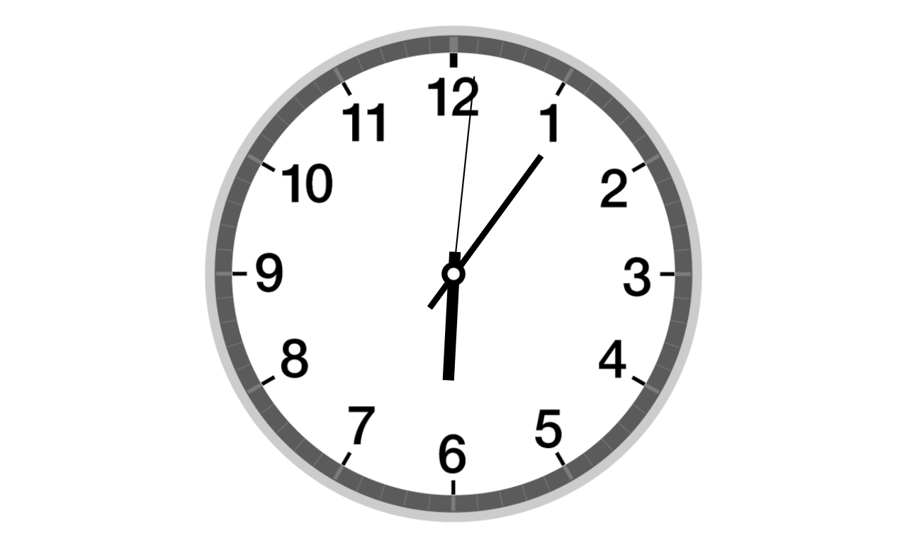
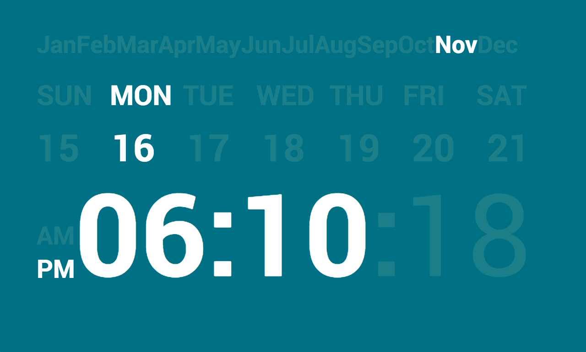
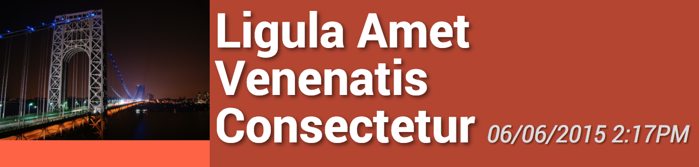
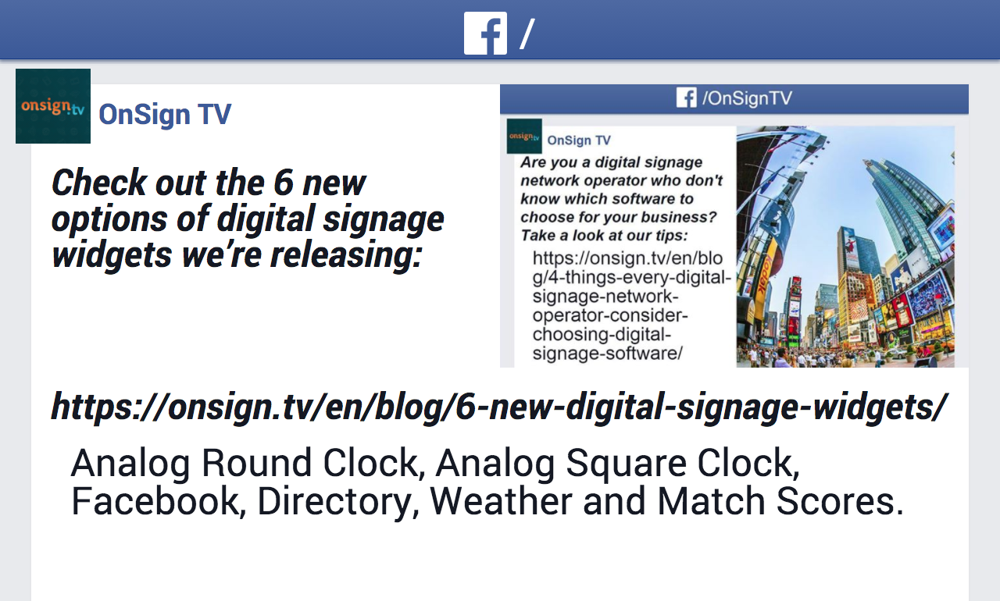
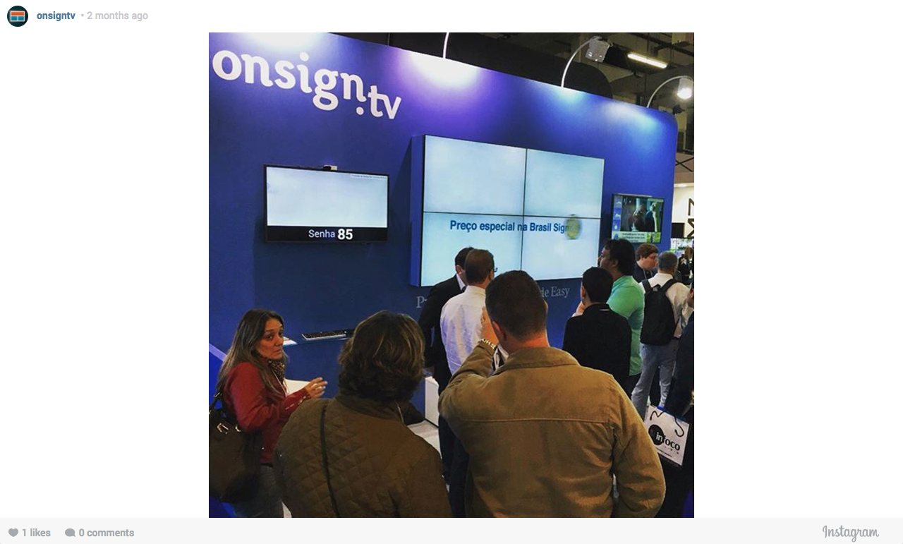
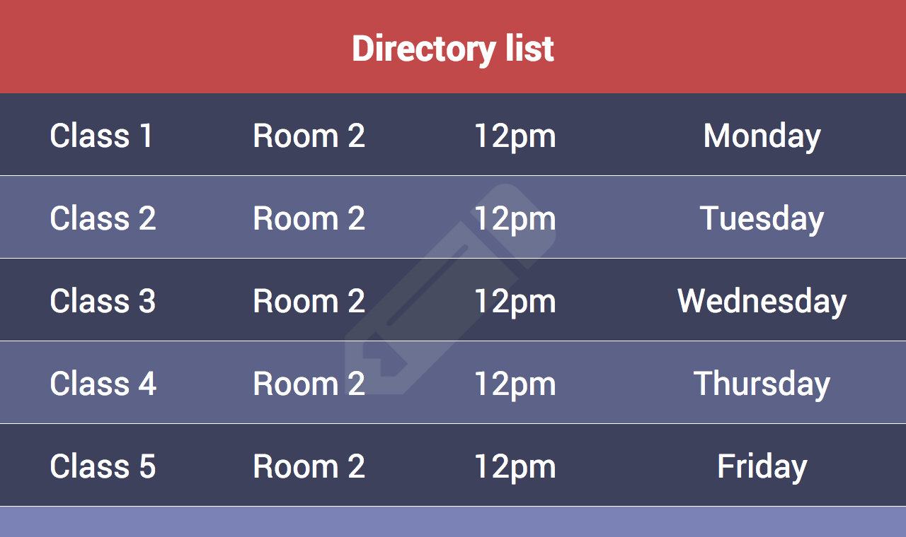
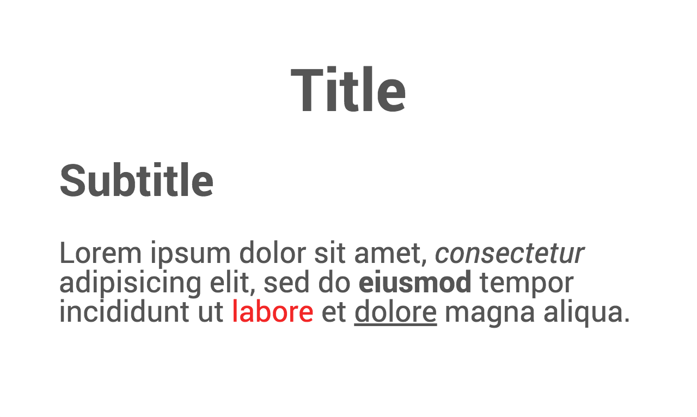
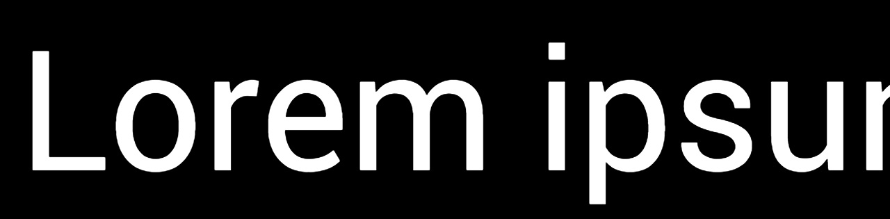
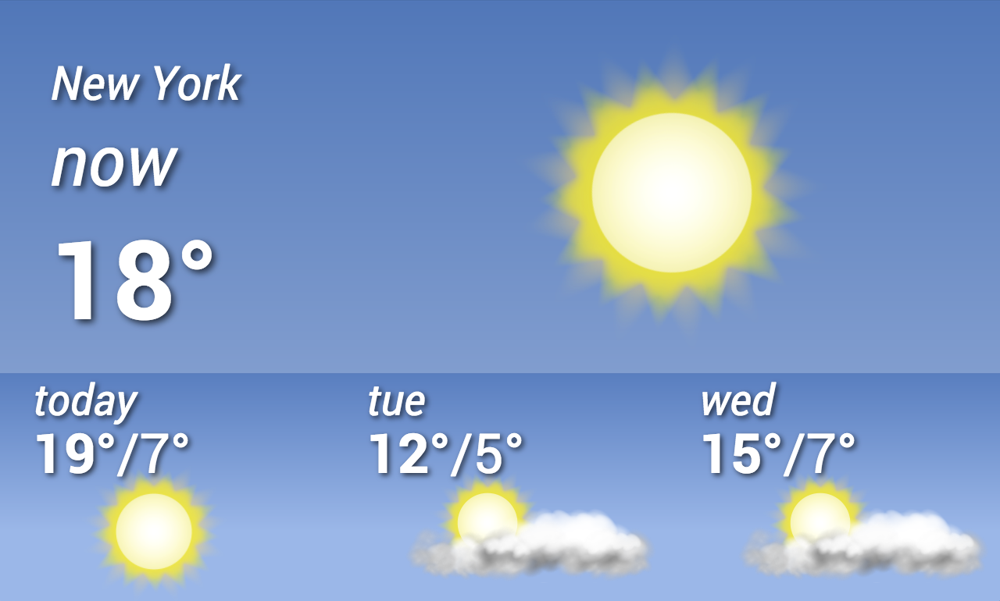
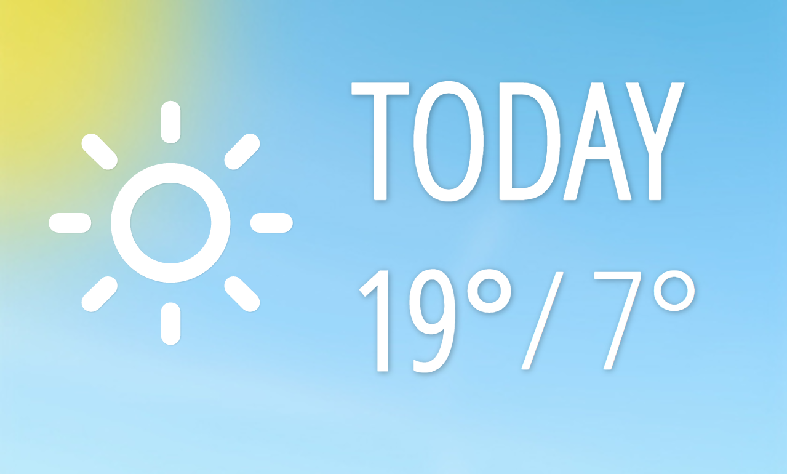

# OnSign TV App Samples

This document shows some of our most used Apps on [OnSign TV](https://onsign.tv/). You can check below a list of apps separated by category. Each category contains at least two examples of how they look when published to a campaign and a small description.

Remember that even though they can appear the same as the screenshot, there are still a variety of configurable options to make them look as you wish. Even better, we are making their code available so you can grab the sample code, create **your own** options and customize it at will to do all sorts of modifications with end-user inputs.

Go see which apps are available and click on the link below the screenshot to be redirected to the correspondent sample code.

## Links

- [Clock Apps](#clock-apps)
- [RSS Apps](#rss-apps)
- [Social Feed Apps](#social-feed-apps)
- [Text based Apps](#text-based-apps)
- [Weather Apps](#weather-apps)

## Apps

### Clock Apps

#### Analogic Rounded Clock

[Check this App code.](clock/analog-round-clock)

#### Fullscreen Date & Time App

[Check this App code.](clock/date-time-fullscreen)

### RSS Apps

#### Flexible News Ticker

[Check this App code.](rss/flexible-news-ticker)

#### Fullscreen Flexible News Feed

[Check this App code.](rss/flexible-news-fullscreen)

#### UOL News Feed

[Check this App code.](rss/uol-rss)

### Social Feed Apps

#### Facebook

[Check this App code.](social/facebook)

#### Instagram

[Check this App code.](social/instagram)

#### Youtube

[Check this App code.](social/youtube)

### Text based Apps

#### Directory App

[Check this App code.](text/directory)

#### Rich Text App

[Check this App code.](text/richtext)

#### Text Crawler App

[Check this App code.](text/crawler)

### Weather Apps

#### Fullscreen Weather Forecast

[Check this App code.](weather/weather-forecast-fullscreen)

#### Horizontal Bar Weather Forecast

[Check this App code.](weather/weather-forecast-horizontal-bar)

#### Small Weather Forecast

[Check this App code.](weather/small-weather-forecast)
